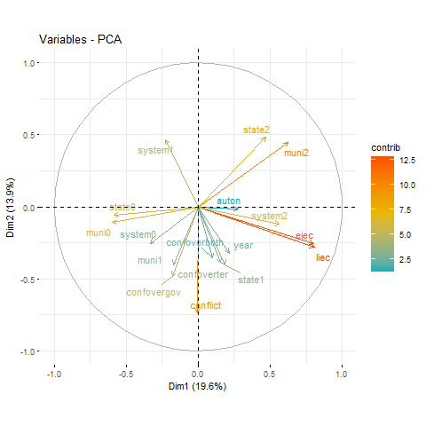

---
title: "Datathon 2"
author: "Seminar 2 - Group A: Theodor King, Thomas Otto, Christopher Terry, Arne Van Stiphout, Sigrid Weber"
date: "28 November 2017"
output: ioslides_presentation
---
<style>
.column-left{
  float: left;
  width: 40%;
  text-align: left;
}
.column-right{
  float: right;
  width: 60%;
  text-align: right;
}
</style>
```{r setup, include=FALSE}
knitr::opts_chunk$set(echo = FALSE, message=FALSE, warning=FALSE)
```
```{r packages}
# Load packages
library(tidyverse)
library(dummies)
library(factoextra)
#library(ggbiplot)
```
##  Introduction
###**Can electoral engineering prevent conflicts?** 

+ Social relevance: Peace processes in (ethnically) divided societies
+ Research gap: testing theoretical argument, mostly case studies

Research Design: 

+ Database of Political Institutions 2015 (World Bank) + UCDP/PRIO
+ PCA, clustering, logistic regression vs Support vector 

Key findings:
???

Previous Work & theoretical framework
---
**"The key to regulating conflict is to change the conditions that encourage it, via alternative institutional designs" (Reilly 2001)**

+ Power-sharing through electoral rules lowers risk of war in diverse societies (Schneider/Wiesehomeier 2008)
+ Case Study Iraq: PR instead of majoritarian systems (Dawisha/Diamond 2006)
+ Minority representation, incentives to cooperate, centripetalism

**H: With increased diversity of the political system, the likelihood of conflicts decreases.**

Unsupervised data exploration 
---
<div class="column-left">
```{r Unsupervised, fig.width = 3, fig.height = 4,out.width =  '300px'}
# Load data
data<-read_csv("https://raw.githubusercontent.com/StsTm/Datathon2/master/dpionset.csv")
data<-data[,c(-1,-2,-17)]
# Clean NAs and transform to factors
data$liec<-ifelse(data$liec==-999,NA,data$liec)
data$eiec<-ifelse(data$eiec==-999,NA,data$eiec)
data$pluralty<-ifelse(data$pluralty==-999,NA,data$pluralty)
data$pr<-ifelse(data$pr==-999,NA,data$pr)
data$sensys<-ifelse(data$sensys==-999,NA,data$sensys)
data$thresh<-ifelse(data$thresh==-999,NA,data$thresh)
data$select<-ifelse(data$select==-999,NA,data$select)
data$auton<-ifelse(data$auton==-999,NA,data$auton)
data$muni<-factor(ifelse(data$muni==-999,NA,data$muni))
data$state<-factor(ifelse(data$state==-999,NA,data$state))
data$author<-ifelse(data$author==-999,NA,data$author)
data$system <-factor(data$system)
data<-data[,-c(6:10,14)]
data<-na.omit(data)
# Create dummies for PCA
system<-dummy(data$system)
muni<-dummy(data$muni)
state<-dummy(data$state)
data<-cbind(data[,-c(3,7,8)],system,muni,state)

##### PRINCIPAL COMPONENT ANALYSIS ON WHOLE DATASET
pr.out <-prcomp(data[sapply(data, is.numeric)],scale=TRUE)
# 17 distinct principal components

# Variance explained by each component
fviz_eig(pr.out) # Scree plot shows that most variance is explained by the first 6 dimensions!

```
</div>
<div class="column-right">
```{r Unsupervised 2,out.width =  '350px'}
# Graph of variables. Positive correlated variables point to the same side of the plot. 
# Negative correlated variables point to opposite sides of the graph.
# Color according to the contribution to the PC
#png("unsupervised.png", pointsize=18)
#fviz_pca_var(pr.out, col.var = "contrib", gradient.cols = c("#00AFBB", "#E7B800", "#FC4E07"),repel = TRUE) 
#dev.off()
#### PRINCIPAL COMPONENT ON SPLITTED DATA ACCORDING TO CONFLICT
#conflict<-subset(data,data$conflict==1)[,-6]
#noconflict<-subset(data,data$conflict==0)[,-6]
#pr.out_conflict <-prcomp(conflict[sapply(conflict, is.numeric)])
#pr.out_noconflict <-prcomp(noconflict[sapply(noconflict, is.numeric)])
# Variance explained by each component
#fviz_eig(pr.out_conflict) # Scree plot shows that most variance is explained by the first 6 dimensions!
#fviz_eig(pr.out_noconflict)
#fviz_pca_var(pr.out_conflict, col.var = "contrib", gradient.cols = c("#00AFBB", "#E7B800", "#FC4E07"), repel = TRUE) 
#fviz_pca_var(pr.out_noconflict,col.var = "contrib",gradient.cols = c("#00AFBB", "#E7B800", "#FC4E07"), repel = TRUE) 

```


Unsupervised: H-clust on first 6 PC 
---
<div class="column-right">
H-clust 6 PC - complete
```{r Unsupervised_hclust, out.width =  '350px'}

#str(data)
hc_com <- hclust(dist(pr.out$x[,1:6]), method="complete")
par(mfrow=c(1,1))
plot(hc_com, cex=.9)
abline(h=7.5, col="red")
#cutree(hc_complete, 2)

```

H-clust 6 PC - correlation
```{r Unsupervised_hclust 2,out.width =  '350px'}
hc_cor = hclust(as.dist(1-cor(t(pr.out$x[,1:6]))), method="single")
par(mfrow=c(1,1))
plot(hc_cor, cex=.9)
abline(h=0.16, col="red")
```
</div>

<div class="column-left">
**Complete vs. Correlation**

+ 6 complete-clusters vs. 1st correlation-cluster

+ what binds 1st correlation-cluster?
  
```{r Unsupervised_hclust 3,out.width =  '350px'}
table(cutree(hc_com,h=7.5), cutree(hc_cor,k=6))
```
</div>

Methodology
--- 
+ Methods: Clustering, Logistic Regression Analysis vs SVM 
+ Operationalisation:
  + Outcome: Conflict onset as binary variable
  + Predictor: Legislative and Executive Indices of Electoral Competitiveness (categorical variable)
  + Controls: Autonomy,  ???

Results: Logistic Regression vs. SVM 
---
Regression output in table format for logistic regression and SVM compared
Calculation of Error rates?
Plot predictions for logistic regression...

Results: Logistic Regression vs. SVM (2)
---
Show results of SVM - Plot

Conclusion and Discussion
---
Overview of the study. 
What have we learned?
Limitations 
Policy implications